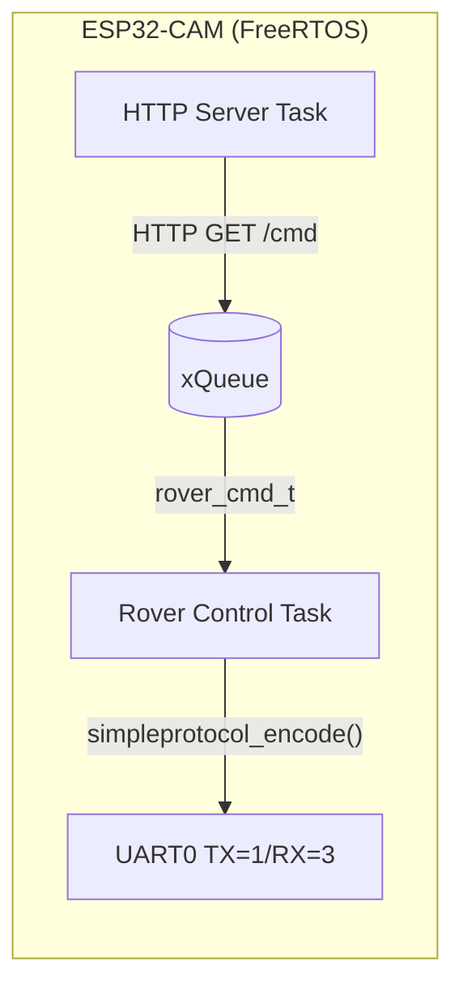

# Firmware ROVER ESP32-CAM (Puente WiFi-UART)

Este repositorio contiene el firmware de comunicaciones para la ESP32-CAM. Actúa como puente inalámbrico, levantando una red WiFi local y traduciendo comandos a tramas binarias (`simpleprotocol`) para la placa STM32.

## 📐 Arquitectura (C Puro + FreeRTOS)

El firmware está escrito a bajo nivel en C puro utilizando la API nativa de **FreeRTOS** (Tareas, Colas) y **CMake**, exactamente igual que el firmware de la Blackpill.



---

## 🛠️ Requisitos de Compilación

A diferencia de la Blackpill que usa un núcleo ARM (`arm-none-eabi-gcc`), la ESP32 usa la arquitectura Xtensa. Por lo tanto, necesitas el compilador y los drivers base del fabricante (SDK):

1. **ESP-IDF v5.x** (Provee el toolchain `xtensa-esp32-elf-gcc` y los drivers WiFi).
2. **CMake** y **Ninja** (o Make).

Puedes descargarlo desde: [Instalador ESP-IDF para Windows](https://dl.espressif.com/dl/esp-idf/).

---

## 🚀 Cómo compilar (Método CMake Puro)

Si bien Espressif ofrece un script de ayuda (`idf.py`), este proyecto usa CMake por debajo, por lo que puedes compilarlo "a la antigua", igual que el firmware del rover:

### 1. Usando CMake estándar
Abre tu terminal, asegurate de tener el toolchain de Xtensa en tu PATH, y ejecuta:

```bash
cd ADEPCUR-ESP
mkdir build
cd build

# Ejecutar CMake apuntando al toolchain de la ESP32
cmake -G Ninja -DCMAKE_TOOLCHAIN_FILE=C:/Ruta/A/esp-idf/tools/cmake/toolchain-esp32.cmake ..

# Compilar
ninja
```

### 2. Usando idf.py (Wrapper de CMake)
Alternativamente, el script oficial automatiza la llamada a CMake:
```bash
idf.py build
idf.py -p COM3 flash
```

---

## 🎮 Uso de la Interfaz Web (Control)

1. Una vez programada, alimentá la ESP32 (esta vez de manera normal, **sin** el puente entre IO0 y GND).
2. Desde tu celular o PC conectate a la red WiFi que genera la placa, llamada **`ROVER_WIFI`** (es abierta, no tiene contraseña).
3. Abrí tu navegador web (Chrome, Safari, etc.) e ingresá la IP por defecto:
   **`http://192.168.4.1`**
4. Vas a ver la consola de mando embebida.
   - Primero presiona el botón **ARM MOTORS** para habilitar los motores en la Blackpill.
   - Luego usa las flechas direccionales manteniéndolas apretadas para moverlo. Al soltar la pantalla, el rover frena de inmediato.

---

## 🔌 Conexionado con la Blackpill

* **ESP32 TX (Pin 1)**  -->  **Blackpill RX (PA10)**
* **ESP32 RX (Pin 3)**  -->  **Blackpill TX (PA9)**
* **GND**               -->  **GND**

Ambas UARTs operan a 3.3V, por lo que el cableado es directo sin conversores de nivel.
